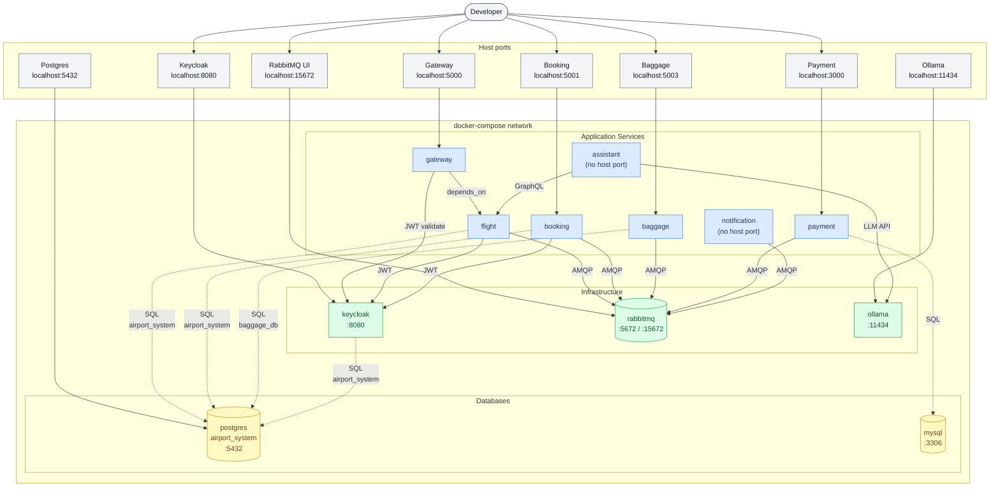

# Local Dev Architecture — docker-compose

> All services run in a single Docker network. Host port mappings shown on entry points.



## Startup order

```
mysql ─────────────────────────────────────────────────────► payment
postgres ──► keycloak ──► flight ──► gateway
         └──────────────► booking
         └──────────────► baggage
rabbitmq ──► flight, booking, baggage, payment, notification
ollama ─────────────────────────────────────────────────────► assistant
```

