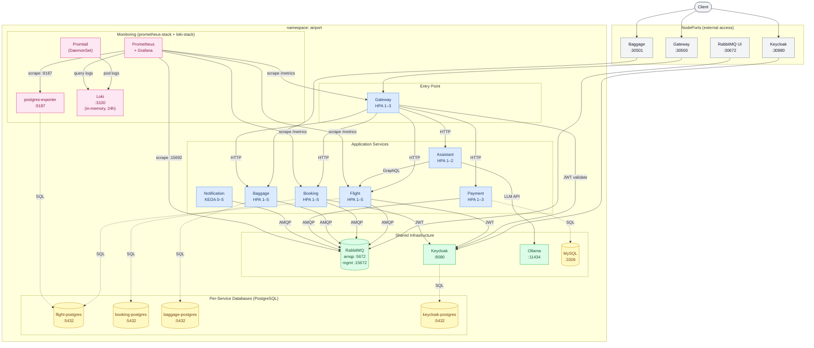

# Kubernetes Architecture — AirportSystem

> **Namespace:** `airport`  
> Autoscaling via HPA (CPU 70% / Memory 80%) unless noted. Notification scales via KEDA on queue depth.

## Resource summary

| Service | Replicas | Scales on | Public |
|---|---|---|---|
| Gateway | 1–3 | CPU / Memory | NodePort :30500 |
| Flight | 1–5 | CPU / Memory | via Gateway |
| Booking | 1–5 | CPU / Memory | via Gateway |
| Baggage | 1–5 | CPU / Memory | NodePort :30501 |
| Payment | 1–3 | CPU / Memory | via Gateway |
| Notification | 0–5 | **KEDA** queue depth | — |
| Assistant | 1–2 | CPU / Memory | via Gateway |
| Keycloak | 1 | — | NodePort :30880 |
| RabbitMQ | 1 | — | Mgmt NodePort :30672 |
| Ollama | 1 | — | — |
| MySQL | 1 | — | — |
| *-postgres | 1 each | — | — |
